<div align="center">

# Vitrina

A shelf read by its spines

[![Live][badge-site]][url-site]
[![HTML5][badge-html]][url-html]
[![CSS3][badge-css]][url-css]
[![JavaScript][badge-js]][url-js]
[![Claude Code][badge-claude]][url-claude]
[![License][badge-license]](LICENSE)

[badge-site]:    https://img.shields.io/badge/live_site-0063e5?style=for-the-badge&logo=googlechrome&logoColor=white
[badge-html]:    https://img.shields.io/badge/HTML5-E34F26?style=for-the-badge&logo=html5&logoColor=white
[badge-css]:     https://img.shields.io/badge/CSS3-1572B6?style=for-the-badge&logo=css3&logoColor=white
[badge-js]:      https://img.shields.io/badge/JavaScript-F7DF1E?style=for-the-badge&logo=javascript&logoColor=black
[badge-claude]:  https://img.shields.io/badge/Claude_Code-CC785C?style=for-the-badge&logo=anthropic&logoColor=white
[badge-license]: https://img.shields.io/badge/license-MIT-404040?style=for-the-badge

[url-site]:   https://vitrina.neorgon.com/
[url-html]:   #
[url-css]:    #
[url-js]:     #
[url-claude]: https://claude.ai/code

</div>

---

## Overview

Vitrina stands a collection of Spanish-language science fiction paperbacks on a
shelf built from their real spine scans. Each book is rendered at the height its
catalogue record gives in centimetres, and the width comes from the scan's own
aspect ratio, so a row comes out as uneven as the shelf it was photographed
from. Click a spine and the book turns around: cover, imprint, translator, cover
artist, table of contents.

It exists because the covers of the Ediciones B lines of the late 1980s and
1990s are hard to find anywhere else. [La Tercera Fundación][tf] scanned them,
and this is a way to stand in front of them.

**Live:** vitrina.neorgon.com

[tf]: https://tercerafundacion.net/biblioteca/

---

## Features

- **Spines at true proportions** -- height from the book's real dimensions,
  width from the scan's aspect ratio, so no two look alike
- **A drawn spine when there is no scan** -- flat and lettered, never passing
  for the real thing, so the shelf stays complete and honest
- **Three views** -- the shelf, a cover gallery, and the catalogue to browse
- **Group and order** -- by your own shelf labels, by the catalogue's
  collection, by author, series or decade; ordered by collection number, which
  is how they would actually stand
- **The whole collection** -- one toggle draws every catalogued volume of each
  collection you own from, your books lit and the rest dimmed, so Nova reads as
  13 of 365 rather than 13. Click a dimmed one to put it on the shelf
- **Gaps in your series** -- volumes the catalogue numbers in a series you
  already collect, one click from the shelf
- **Add from the catalogue** -- 774 records across the five collections this
  shelf touches, each arriving with its cover and spine
- **Add by hand** -- for a book no catalogue has, with your own image URLs
- **Shelf report** -- how many centimetres of shelf, which authors, which
  editions have no spine scan
- **Yours, locally** -- the shelf lives in this browser, exports to JSON and
  imports back

---

## Keyboard

| Key | Does |
|---|---|
| `1` `2` `3` | Shelf, Covers, Browse |
| `/` | Focus the search box |
| `a` | Add a book |
| `←` `→` | Walk along the row with a book open |
| `Esc` | Close the drawer or dialog |

---

## Where the data comes from

[La Tercera Fundación][tf] is a volunteer catalogue of Spanish-language science
fiction, and it has no public API, so `scripts/scrape.py` reads it: one request
every 1.2 seconds, a descriptive User-Agent, and an on-disk cache so a re-run
costs nothing. `robots.txt` allows it.

**Images are hotlinked, never copied.** The catalogue serves them from
Cloudflare with a one-year cache header and no hotlink protection, so this repo
carries no cover art. It carries bibliographic facts only: titles, authors,
imprints, ISBNs, formats, page counts, tables of contents. Back cover copy is
deliberately not stored; the drawer links to the record instead.

```bash
python3 scripts/scrape.py resolve   # my list -> candidate editions
python3 scripts/scrape.py detail    # picked editions -> data/library.json
python3 scripts/scrape.py catalog   # the collections my books live in
python3 scripts/scrape.py spines    # which editions have a scanned spine
python3 scripts/scrape.py cache-images            # local fallback copies
python3 scripts/scrape.py cache-images --catalog  # ...for every browsable record
```

Images are asked of the catalogue first, then of `data/images/` if a copy was
cached there, and only then does the shelf draw a spine instead. That middle
step is gitignored, so a published page never finds it and falls straight
through to the drawn spine.

`scripts/rank.py` scores the candidates for each wanted title and writes one
brief per book, which is what makes choosing between four editions of the same
novel a reading job rather than a guessing one.

---

## Running locally

ES modules require an HTTP server (not `file://`):

```bash
make serve      # http://localhost:8881
```

---

## Architecture



```
vitrina-site/
├── index.html              # app shell: controls, three views, drawer, dialogs
├── css/
│   └── style.css           # site styles; tokens come from the CDN base.css
├── js/
│   ├── app.js              # entry point, loads then wires
│   ├── state.js            # the shelf, and the only localStorage caller
│   ├── data.js             # loading, grouping, ordering, series gaps
│   ├── shelf.js            # spine geometry: cm to pixels, aspect to width
│   ├── render.js           # the three views
│   ├── detail.js           # the drawer for one book
│   ├── browse.js           # the catalogue, with owned books marked
│   ├── modals.js           # add, import, export, shelf report
│   ├── events.js           # every listener; no inline onclick anywhere
│   └── utils.js            # folding, parsing cm and years, toast, download
├── scripts/
│   ├── tf.py               # parser for tercerafundacion.net, no network in it
│   ├── scrape.py           # the polite, cached client and its five modes
│   └── rank.py             # scores candidate editions, writes per-book briefs
└── data/
    ├── wantlist.json       # what I own, by hand
    ├── candidates.json     # every catalogued edition of each wanted title
    ├── picks.json          # which edition, and why
    ├── library.json        # the shelf: 39 books, full records
    ├── catalog.json        # 774 browsable records across 5 collections
    └── spines.json         # which editions have a scanned spine
```

---

<div align="center">
<sub>Part of <a href="https://neorgon.com/">Neorgon</a></sub>
</div>
